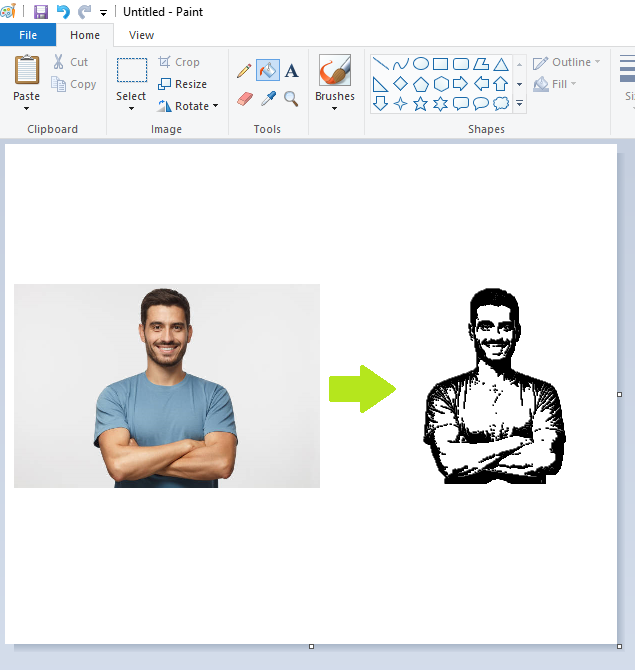

# Autodraw
An automatic lineart image printer that can be used with any paint software.

## Use:
- Open up preferred paint software, such as MS Paint and place cursor on canvas
- Run python script: python pydirectautodraw.py image_name_here
  - The image file must be in the "photos" directory

